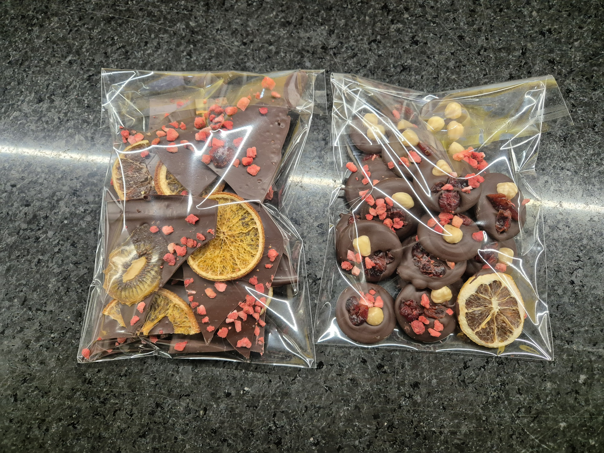
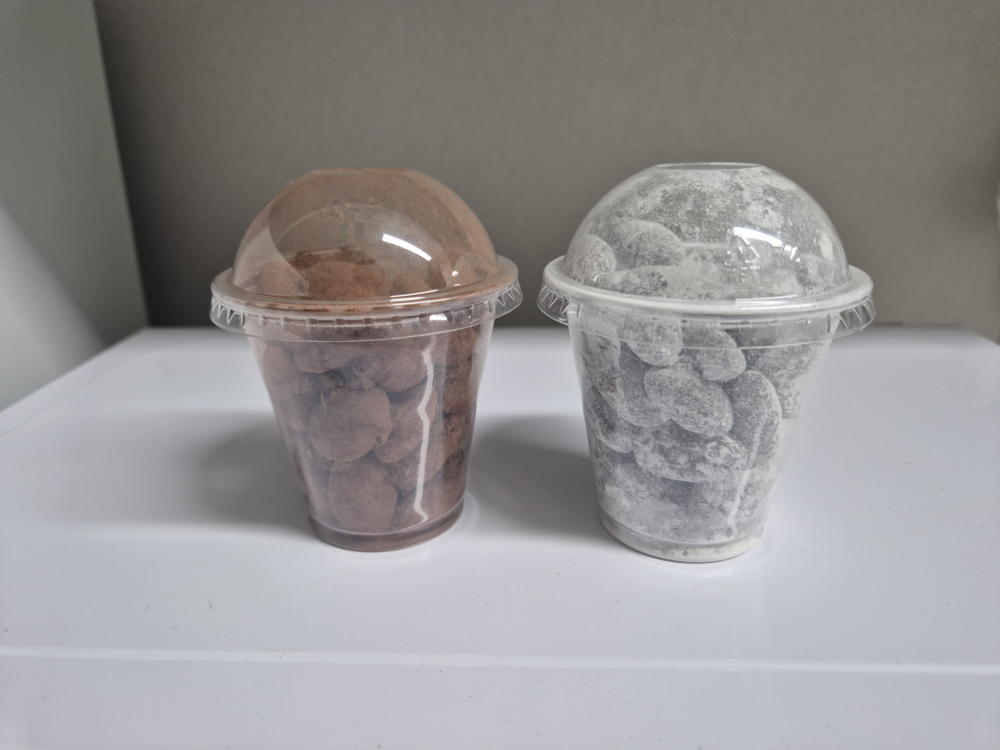
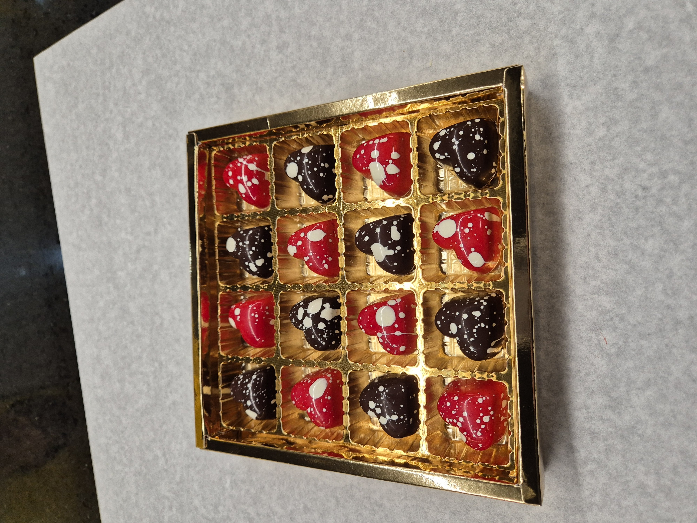
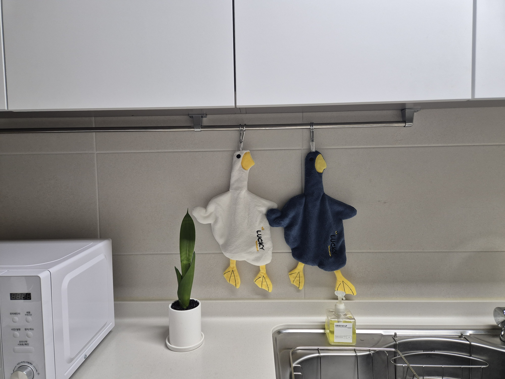
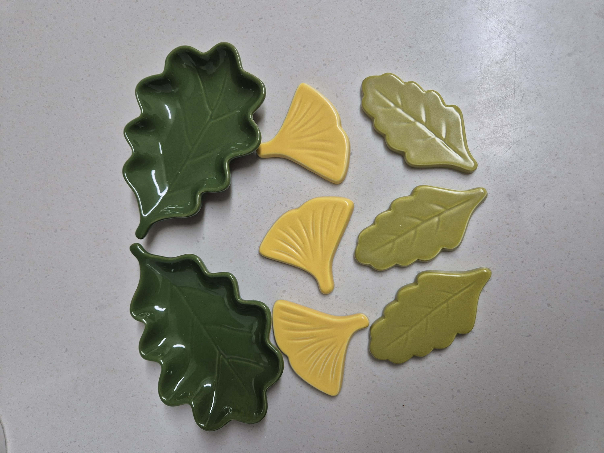
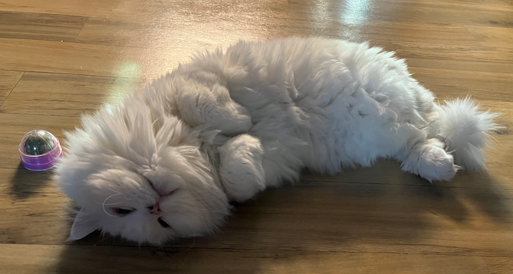

# 서민아

## 🥸 인적사항

- name : 서민아
- github : ..
- age : 미상
- blog : ..
- 회사 : KT
- 부서 : Service Tech Lab / Robot 주행 Tech Project

## 🥕 좋아하는 것

- 요즘은 초콜릿 만들기를 하고 있습니다

    </img>
    </img>
    </img>
    </img><br/>

<br>

- 귀여운 것 사는것도 좋고

    </img>
    </img><br/>
    
- 옆집 고양이도 좋아합니다

    </img><br/>

## 🐿 아무말

멀티로봇 제어 기능 개발을 하고 있습니다

저는 특히 아래 언어들을 좋아하고 많이 사용해요.


```python
import you

you.today('happy!')
```

---
